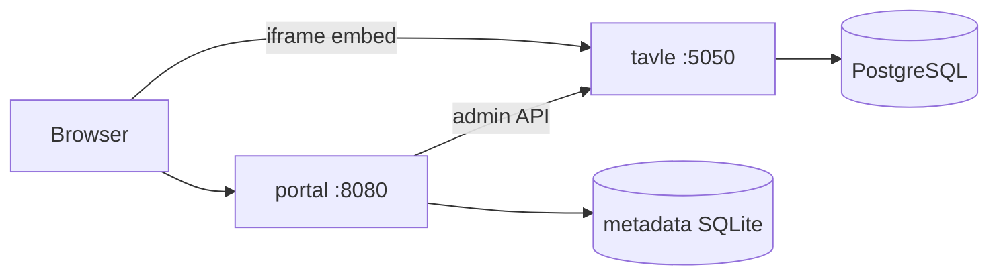

# Tavle App

Web portal for [Tavle](https://github.com/Den-Frie-Digitale-Skole/tavle) whiteboards — organize boards into groups, add notes and tags, and open boards in an embedded view.

Runs with **Docker Compose** (Tavle + PostgreSQL + portal). No desktop app, no vendored Tavle source in git.

## Quick start

```bash
cp .env.example .env
docker compose up --build
```

Open **http://localhost:8080** — complete first-time setup (admin API token), then use the library.

|Tavle (boards, iframes)|http://localhost:5050|
|Portal (library UI)|http://localhost:8080|

## What's in the stack



| Service | Role |
|---------|------|
| **portal** | React UI + FastAPI (`/api/*`) for groups, board links, Tavle proxy |
| **tavle** | Upstream whiteboard (cloned at Docker build) |
| **tavle-db** | PostgreSQL for Tavle data |

## Configuration

Copy [`.env.example`](.env.example) to `.env`:

| Variable | Purpose |
|----------|---------|
| `ADMIN_API_TOKEN` | Tavle admin API token (set after setup, or from `/setup`) |
| `TAVLE_PUBLIC_URL` | URL browsers use for board iframes (default `http://localhost:5050`) |
| `TAVLE_EMBED_FRAME_ANCESTORS` | Must include portal origin (`http://localhost:8080`) |

## Local frontend development

```bash
# Terminal 1 — stack
docker compose up --build

# Terminal 2 — Vite dev server (proxies /api to portal)
npm install
npm run dev
```

Open http://localhost:5173

## Dev compose (SQLite Tavle, Flask debug)

```bash
docker compose -f docker-compose.yml -f docker-compose.dev.yml up --build
```

## Features

- Groups and unassigned boards (metadata in portal SQLite volume)
- Sync / create / delete boards via Tavle admin API
- Embed boards with `?embed=1`
- First-time setup in the portal UI

## License

Wrapper: project default. Tavle: upstream repository.
